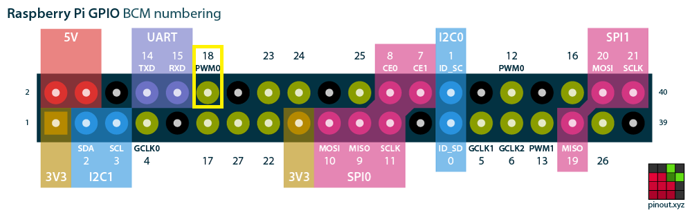

# Ping Pong Ball Clock

Raspberry Pi code for the Ping Pong Ball Clock Project

Author: PlanetaryMotion

---

## Video

https://www.youtube.com/watch?v=jIoWmhVCPb4&feature=youtu.be

## Inspiration

A reddit post originally tipped me off to the project. This [thingiverse](https://www.thingiverse.com/thing:4091854) project detailed some 3D printed parts for a ping pong ball clock. Upon further investigation I found an [instructable](https://www.instructables.com/id/Ping-Pong-Ball-LED-Clock/) project that laid out designs that did not involve 3D printing and optimized the LED placement. I used this instructable project as the basis for the hardware design. However, I knew from the start that I was going to control the clock using a raspberry pi (zero) and that I would build upon a previous project that controlled LEDs using a local web app.

## Software Design Concept

This firmware is centered in python because of how easy it is to use and a couple easy to use and essential libraries:

- Neopixel libraries
- Flask (web server)

The layout of the LED strips called for a font libraries and character writing functions to be written from scratch. This project only pulled from a previous project the code to be able to light up an LED. 

The the following images gave me a concept of how I was going to program the LED display with each vertical red line in the first image being an LED strip:

## Implementation

Font libraries and things related to the layout can be found in [Utils](code/Utils.py). 

The functions that drive almost every single part of the lighting and logic and display can be found in [LEDUtils](code/LEDUtils.py).

The [flaskUtils](code/flaskUtils.py) file contains all of the api views that respond to POST and GET requests from the web app.

Other things that serve the web app are found in [templates](code/templates/), [static](code/static/)

---
## Wiring

**WARNING: You may not have wired your LEDs like I did. This means that you will need to adjust the ledAdresses list in [Utils](code/Utils.py). How to do this and sort it out is described in this [issue](https://github.com/PlanetaryMotion/pingPongBallClock/issues/32).**

It is worth considering running a separate 5V power supply to power just the LEDs since you will be powering at least 128 of them. Then the only two wires that run to the raspberry pi from the LEDs are the data and ground wires. If you use a separate power supply, you must run a ground wire from the ground of the power supply to the raspberry pi ground so that logic is consistent, otherwise the LEDs will not light properly.  

The data wire should be run to pin "18" as indicated below. This is how the code is set up currently. If you want to change the pin, make sure that you adjust the "LED_PIN" value in [Utils](code/Utils.py). 

The ground wire can be run to any of the ground pins on the pi (black circles below). You can use the 5V pins to test short strands of LEDs but you **should not try to power the full length of LEDs with it. This has the potential to damage your pi.** Most noticible though, it will change the color of your LEDs throughout the strip because of the lack of power.

## Build

You must first make sure that git is installed on your raspberry pi so that you can clone the repo. First run `sudo apt-get update` to make sure that you have the correct package directory listings. Then run `sudo apt-get install git`. You then should be able to clone this repo by running `git clone https://github.com/PlanetaryMotion/pingPongBallClock.git`.

You should be able to build this by running `sudo sh setup.sh` from the `code` directory. After that you should be able to run `sudo python main.py` from the `code` directory to start the program. If you get errors, you may need to debug from the error logs to see what packages need installing. They should all be found in `setup.sh`. One known error right now is that the crontab script does not copy properly. You can manually copy the crontab script to the root crontab file by running `sudo cp ~/pingPongBallClock/code/crontabScript /var/spool/cron/crontabs/root` followed by `sudo chmod 600 /var/spool/cron/crontabs/root`. This allows the clock code to run when the raspberry pi boots up.

The webpage will be located at the local IP address of your Raspberry Pi and at port 5000. For instance, my local address for the clock was `192.168.1.22:5000`. If you need help finding the IP address of your Raspberry Pi, you can reference this [article](https://www.raspberrypi.org/documentation/remote-access/ip-address.md). I imagine that if you got this far, you can find it on your own though ;]

## Setup

The Ping Pong Ball Clock is setup by default for 128 balls/LEDs and an layout of 20 rows and 7 columns. In the settings section you can set up the display for more. You can also change the text origin row and column, as well as how many lines are on screen to adjust the way the text displays. It is recommended that you have at least 10 rows to display two lines of text on the screen because the text fonts are 5 balls tall.

## Weather API Key (Required for weather content)

Weather is collected via the Open Weather API. This means that an API key is required to use this feature. An API key is free and can be aquired [here](https://openweathermap.org/appid). The firmware for Ping Pong Ball Clock was written with the maximum number of API calls to the weather service in mind. This firmware will only make a new call when the weather settings have been changed, or every minute. This should avoid the 60 calls/min maximum for the free version.

## Usage

Please fork/clone this repo and make it your own. I would love to see some pull requests. This is a just a side hobby of mine so it may take me some time to get around to reviewing and merging. Also, FYI, not a developer IRL. This is just what I do for fun. Learning as I go. Feel free to contact me! 

## The Future

I plan on making more clocks, and adding more features as I go. I will even make a jumbo clock soon so the code should be designed to be able to fit to any clock size with some tweaking. 
